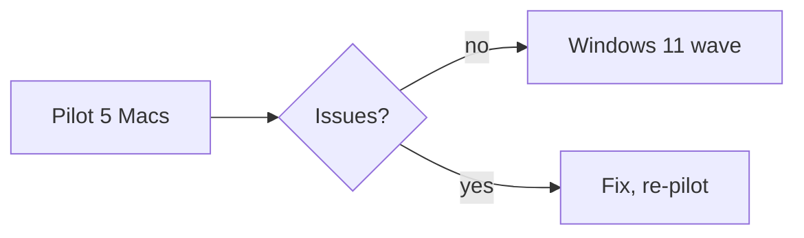

# Worked examples

All requests go through the runtime-provided `http://admin-api:3000`, `X-Gateway-Token: $GATEWAY_TOKEN`, `$AGENT_ID`, and the numeric `$ROOM_ID` of the `[Room: …]` message being answered.

## 1. Designed HTML report (standard flow)

User: "정리해서 보고서로 줘" after a pricing analysis.

Design plan (written before code):

- **Subject / job**: three pricing tiers, two proposed changes; the page exists so a product lead can decide by 12 September.
- **Treatment**: utilitarian. A decision memo, not a landing page. Single column, ~480 px.
- **Color**: ground `#F7F6F2`, surface `#FFFFFF`, ink `#1D1F24`, muted `#5C6070`, accent `#1F5F8B` (a cool ink-blue that reads as "finance" without going corporate); dark set redefined under `prefers-color-scheme`.
- **Type**: display "Iowan Old Style" → Georgia; body "Avenir Next" → Segoe UI → Pretendard; mono for SKU codes. System stacks only.
- **Layout**: eyebrow + title + one-sentence decision ask, two change cards, one comparison table in a scroll container, a closing "decision needed" card. `<style>` at the end of `<body>`.

Save:

```bash
python3 - <<'PY' | curl -s -X POST "http://admin-api:3000/internal/chat-rooms/$ROOM_ID/artifacts" \
  -H "Content-Type: application/json" -H "X-Gateway-Token: $GATEWAY_TOKEN" --data-binary @-
import json, os
print(json.dumps({
  "from_agent_id": os.environ["AGENT_ID"],
  "identifier": "q3-pricing-review",
  "type": "html",
  "title": "Q3 Pricing Review",
  "content": open("/workspace/q3-pricing-review.html", encoding="utf-8").read(),
}, ensure_ascii=False))
PY
# → 201 {"artifact":{"identifier":"q3-pricing-review","version":1,...}}
```

Send:

```bash
curl -s -X POST http://admin-api:3000/internal/messages \
  -H "Content-Type: application/json" -H "X-Gateway-Token: $GATEWAY_TOKEN" \
  -d "{\"from_agent_id\":\"$AGENT_ID\",\"room_id\":$ROOM_ID,\"content\":\"Q3 가격 검토 보고서입니다. 12일까지 결정이 필요한 두 변경안을 마지막 카드에 모았습니다.\",\"artifact_refs\":[{\"identifier\":\"q3-pricing-review\",\"version\":1}]}"
```

WebUI output: `NO_REPLY`.

## 2. Revision of the same deliverable

User: "Pro 티어 숫자 수정했으니 반영해줘".

Same identifier, `expectedVersion: 1` (the stored value). Response gives `version: 2`; the message references 2 and says what changed.

```python
payload["identifier"] = "q3-pricing-review"
payload["expectedVersion"] = 1
# → 201 {"artifact":{"version":2,...}}   or   409 {"error":"Artifact version conflict","latestVersion":2}
```

On `409`: `GET …/artifacts/q3-pricing-review?from_agent_id=$AGENT_ID`, merge, save again with `expectedVersion` = returned `latestVersion`.

If nothing actually changed, the save returns the existing version unchanged — reference that version; do not expect a bump.

## 3. Markdown decision record with a mermaid diagram

User: "회의 내용 결정사항 위주로 기록해줘".

Prose-first, one short table, one flow → `markdown` (follows the portal theme, mermaid renders natively).

```markdown
# Node Rollout Decisions

Three decisions from the 28 August sync; owners and dates are in the table.

## Decisions
| # | Decision | Owner | By |
|---|---|---|---|
| 1 | Pilot on 5 Macs first | Platform | 4 Sep |

## Rollout flow

```

Save with `"type": "markdown"`, identifier `decision-record-2026-08-28-node-rollout`, then send `artifact_refs` as in example 1.

## 4. What not to do

```json
{ "content": "```html\n<!doctype html>…\n```\n\n또는 파일: /workspace/report.html" }
```

Plain text only — no card, no panel, no version. And in the WebUI final text: nothing but `NO_REPLY`.

```json
{ "artifacts": [ … ], "artifact_refs": [ … ] }
```

`400` — the two fields are mutually exclusive.

## 5. Interactive request

User: "필터 되는 대시보드로 만들어줘".

Scripts do not run in the artifact frame. Say so in one sentence, then deliver the best static version: a summary block, state pills, and CSS-only `<details>` sections per filter value. If real interactivity is required, that is a different capability (a served page or a Claude Design canvas), not a room artifact.

## 6. Splitting an over-long deliverable

A 320,000-character page exceeds the 200,000 limit. Remove embedded raster data URIs first (inline SVG or an `https:` image URL). If still too long, split by section into at most five artifacts with distinct identifiers (`audit-2026q3-part-1`, `…-part-2`), each a complete self-contained document, save each, and send one message whose `artifact_refs` lists them in reading order with a body that says how they relate.
