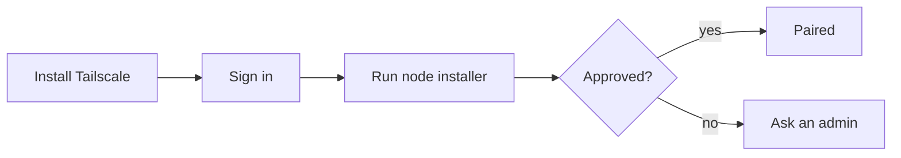

# Markdown artifacts

Rendered by `react-markdown` with `remark-gfm` and `rehype-sanitize`, inside the portal's `prose prose-sm dark:prose-invert` styles (verified in `markdown-renderer.tsx`). The renderer controls typography and color and follows the portal theme, so the design craft moves entirely into structure and words.

## What renders

- Headings, paragraphs, emphasis, lists, **GFM tables**, task lists, blockquotes, links (open in a new tab), `~~strikethrough~~`.
- Fenced code with a language tag; a copy button is added automatically.
- ```` ```mermaid ```` blocks render to SVG (flowchart, sequence, state, ER, Gantt, class, pie, git graph). Keep them small enough for a ~480 px column or they will scroll horizontally.
- Images only from `https:` URLs. `data:` URIs are removed by the sanitizer.

## What does not render

- Raw HTML: `<div>`, `<span style>`, `<script>`, inline event handlers, `javascript:` links — all stripped. Do not rely on HTML inside markdown for layout or color.
- Footnotes and math are not enabled.

## Watch for

- `task-123`, `back-45`, `#task-7` patterns are auto-linked to the portal task board. Write ticket-like tokens in backticks if they are not portal tasks.
- The card preview is the first 240 characters of the content with any `<tags>` removed, so the H1 and the lede sentence become the preview. Open with them.

## Structure carries the design

- **One H1** that is the artifact's name; it should match `title`.
- A one-paragraph lede directly under it.
- Headings encode the reading path. Do not number sections unless the content is a real sequence.
- Lists for parallel items; tables for comparisons with the same attributes per row; paragraphs for reasoning. Never a list of one.
- Tables: header row, right-aligned numeric columns (`---:`), units in the header not the cells, at most five columns in a 480 px column before you switch to HTML.
- Commands the reader will run get their own block, one command per block.
- Emphasis is information: bold the decision, the deadline, the owner — never a whole sentence.
- No emoji as section markers; no horizontal rules as decoration (a rule marks a real change of part).

## Words

Write from the reader's side. Active voice. Name things as people recognize them. State facts separately from assumptions. The requested action, owner, and deadline are explicit and near the top when the artifact asks for a decision.

## Example shape

```markdown
# Node Onboarding Runbook

Connect a Mac or Windows 11 machine to ClawPod as a node in about ten minutes; the only human steps are sign-in and approval.

## Before you start
- Admin access on the machine
- The organization's Tailscale login link

## Flow


## Verify
| Check | Command | Expected |
|---|---|---|
| Node visible | `clawpod node status` | `paired` |
```
